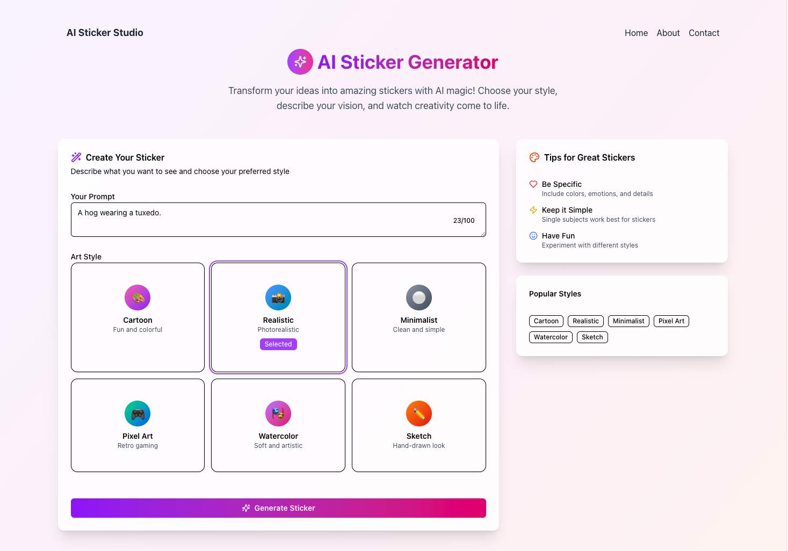

# AI Sticker Studio

Welcome to AI Sticker Studio! This is a Next.js application that allows you to generate unique stickers using AI. Simply type a prompt, select a style, and let the AI bring your ideas to life.



## ✨ Features

- **AI-Powered Sticker Generation**: Create stickers from text prompts.
- **Multiple Styles**: Choose from a variety of styles to customize your stickers.
- **Gallery**: View and download your generated stickers.
- **Responsive Design**: Works on all devices.

## 🚀 Getting Started

First, you need to set up your environment variables. Create a `.env.local` file in the root of the project and add the following:

```
OPENAI_API_KEY=<your-openai-api-key>
OPENAI_MODEL=<open-ai-image-model> # dall-e-2 or #dall-e-3
```

Then, run the development server:

```bash
npm run dev
# or
yarn dev
# or
pnpm dev
# or
bun dev
```

Open [http://localhost:3000](http://localhost:3000) with your browser to see the result.

## 📸 Screenshots

You can add screenshots of the application in the `screenshots` folder.

## 🛠️ Built With

- [Next.js](https://nextjs.org/) - React Framework
- [Tailwind CSS](https://tailwindcss.com/) - CSS Framework
- [Hugging Face](https://huggingface.co/) - AI Models

## 📄 License

This project is licensed under the MIT License.
